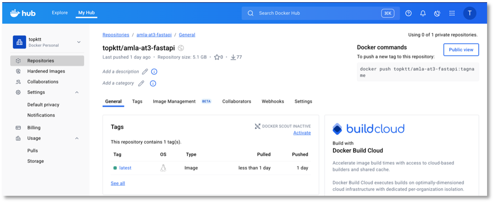
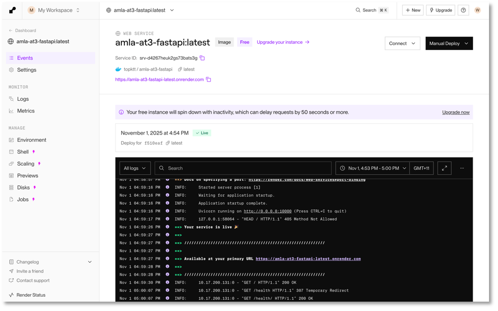

## Project Overview

This repository contains the complete research, modelling, and integration workflow behind Crypto Insight, a production-style cryptocurrency forecasting platform.

The system forecasts the next-day HIGH price (t+2 horizon) for major cryptocurrencies using machine learning models deployed through cloud-hosted APIs and visualised via an interactive Streamlit application.

This project demonstrates:

* Time-series safe modelling
* Feature engineering for volatile markets
* Baseline benchmarking
* API-based model serving
* Docker containerisation
* Cloud deployment
* Interactive analytics

## Why t+2 Forecasting?

Cryptocurrency HIGH prices are only fully known after market close. To avoid information leakage and ensure causally valid inference, we predict the HIGH price at Day + 2.

This ensures:

* No lookahead bias
* Production-realistic deployment
* Clean temporal validation

  

## End-to-End System Architecture

The data product follows a modular architecture separating the research layer, model serving layer, and presentation layer.

  

**Pipeline Flow**

* Live OHLC data fetched from Kraken API
* Feature engineering and preprocessing
* Model inference via FastAPI
* Containerised deployment using Docker
* Cloud hosting on Render
* Streamlit frontend for interactive forecasting

## Production Deployment Components

**Docker Containerisation**

Each model API is packaged as a Docker container to ensure dependency isolation, reproducibility, portability, and environment consistency.

  

**FastAPI Deployment on Render**

Inference services are hosted on Render with:

* Automated GitHub builds
* HTTPS endpoints
* Environment variable configuration
* Scalable infrastructure

  

## Interactive Web Application

The Streamlit frontend provides:

* Historical OHLC visualisation
* Technical indicators (RSI, moving averages)
* Real-time prediction display
* Model performance comparison dashboard

  

## Repository Ecosystem

This project is structured across three repositories.

**ML Research & Model Development (This Repository)**

Purpose: Core modelling and experimentation. Contains:

* Data preprocessing pipelines
* Feature engineering
* Time-aware cross-validation
* Hyperparameter optimisation
* Baseline benchmarking
* Model artefact export

**Production API Layer**

Repository: https://github.com/KittituchW/crypto-forecast-api

Implements:

* FastAPI inference services
* Live Kraken OHLC integration
* Serialized model loading
* `/predict/{pair}` endpoints
* Docker containerisation
* Cloud deployment

**Web Application Layer**

Repository: https://github.com/KittituchW/AMLA_Group13_Streamlit

Implements:

* Streamlit UI
* API routing
* Technical indicator computation
* Plotly visualisation
* Performance dashboard

Live App: https://kittituchw-amla-group13-streamlit-appmain-irplhq.streamlit.app/

## Supported Assets & Algorithms

| Asset | Algorithm | Rationale |
|-------|-----------|-----------|
| Bitcoin (BTC) | CatBoost | Handles multicollinearity and volatility |
| Ethereum (ETH) | Linear Regression | Interpretable and stable |
| Ripple (XRP) | LightGBM | Efficient gradient boosting |
| Solana (SOL) | XGBoost | Regularised nonlinear modelling |

All models were evaluated against a naive persistence baseline.

## Technology Stack

| Layer | Technology |
|-------|------------|
| Programming | Python 3.11 |
| ML Libraries | scikit-learn, XGBoost, LightGBM, CatBoost |
| Optimisation | Hyperopt |
| Explainability | SHAP |
| API | FastAPI |
| Containerisation | Docker |
| Cloud | Render |
| Frontend | Streamlit |
| Visualisation | Plotly |

## Engineering Highlights

* Time-series safe validation strategy
* Explicit leakage prevention
* Baseline benchmarking
* Modular microservice architecture
* Cloud-native deployment
* Model artefact versioning
* Separation of research, inference, and presentation layers

## From Research to Production

This project demonstrates how machine learning research transitions into reproducible training pipelines, serialized model artefacts, production APIs, cloud deployment, and real-time user-facing applications.

It serves as a scalable blueprint for applied financial forecasting systems.
